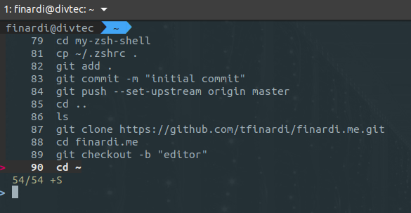
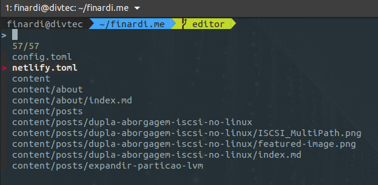
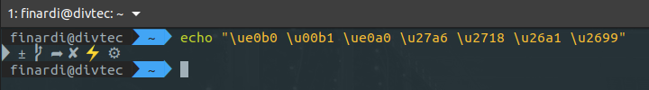

Se você, assim como eu, utiliza diariamente o terminal Shell no Linux para trabalho ou estudo, irá gostar de
personalizar o seu shell para otimizar suas tarefas do dia a dia. Além de deixar o visual do modo que mais
lhe agradar. Neste post, irei compartilhar o procedimento que utilizo para personalizar o meu `Shell` padrão
com o `Oh My ZSH`.

### [ZSH e Oh My ZSH](https://github.com/ohmyzsh/ohmyzsh)

O ZSH é basicamente um interpretador de comandos `UNIX` (Shell), assim como o famoso `Bash`.
Já o Oh My ZSH é um framework para  gerenciamento de configurações do ZSH. Ele possui milhares de funções,
helpers, plugins, temas e possibilidade de personalizações.

### Instalação e configuração

Em todas as distribuições Linux que utilizei o pacote se chama `zsh`

| Distribuição | Como instalar |
| --- | --- |
| Arch / Manjaro | ```pacman -S zsh zsh-completions``` |
| CentOS / Red Hat / Fedora | ```dnf install zsh``` |
| Debian / Ubuntu / Mint | ```apt install zsh``` |

Para instalar o Oh My Zsh via `curl` rode o seguinte comando:

```bash
sh -c "$(curl -fsSL https://raw.github.com/ohmyzsh/ohmyzsh/master/tools/install.sh)"
```
Após o processo de download e instalação, você verá a seguinte tela:



Caso por algum motivo não apareça a mensagem de `Shell changed.`, basta digitar `zsh` e teclar `enter`. **`Porém essa alteração valerá somente para a sessão atual`**.


Para definir o zsh como seu shell padrão, rode o seguinte comando:

```bash
sudo usermod --shell $(which zsh) $USER
```

Esta alteração valerá somente para as próximas sessões do shell.



### Adicionando Plugins
Os plugins do Oh My Zsh possibilitam você a possibilidade de adicionar funcionalidades extras ao seu shell.
Para verificar as inúmeras possibilidades, dê uma conferida na [Wiki do repositório](https://github.com/ohmyzsh/ohmyzsh/wiki/Plugins). 

#### [zsh-syntax-highlighting](https://github.com/zsh-users/zsh-syntax-highlighting)
Este plugin fornece destaque da sintaxe para o shell zsh. Ele permite realçar os comandos enquanto eles são digitados. Isso ajuda a 
revisar os comandos antes de executá-los, principalmente na detecção de erros de sintaxe.

Para instalar o plugin, basta rodar o seguinte comando:

```shell
git clone https://github.com/zsh-users/zsh-syntax-highlighting.git \
${ZSH_CUSTOM:-~/.oh-my-zsh/custom}/plugins/zsh-syntax-highlighting
```

Agora, adicione o `zsh-syntax-highlighting` na lista de plugins do seu **`~/.zshrc`**

```shell
plugins=(
  git
  zsh-syntax-highlighting
)
```

Basta carregar a nova configuração com o comando **`source ~/.zshrc`**

#### [zsh-autosuggestions](https://github.com/zsh-users/zsh-autosuggestions)
Este plugin sugere comandos e baseado no seu histórico de comandos já executados. Este é como vinho :wine_glass:, vai melhorando
com o passar do tempo. :wink:

Para instalar o plugin, basta rodar o seguinte comando:
```shell
git clone https://github.com/zsh-users/zsh-autosuggestions \
$ZSH_CUSTOM/plugins/zsh-autosuggestions
```
Agora, adicione o `zsh-autosuggestions` na lista de plugins do seu **`~/.zshrc`**

```shell
plugins=(
  git
  zsh-syntax-highlighting
  zsh-autosuggestions
)
```
Carregue a nova configuração com o comando **`source ~/.zshrc`**

#### [fzf](https://github.com/junegunn/fzf)
o FZF é um buscador de arquivos interativo para linha de comando que pode ser usado com qualquer lista; arquivos, histórico de comandos, processos, nomes de host, favoritos, git commits, etc.

Para instalar o plugin, basta rodar o seguinte comando:
```shell
git clone --depth 1 https://github.com/junegunn/fzf.git ~/.fzf && ~/.fzf/install
```

Responda sim (Y) para todas as perguntas.


Agora você já pode telcar `Ctrl + R` para acessar a busca pelo histórico:



E para acessar a busca por arquivos, basta teclar `Ctrl + T` ou `Alt + C`



### [Temas](https://github.com/ohmyzsh/ohmyzsh/wiki/Themes)
Aqui temos uma grande variedade de opções, podendo personalizar cada um deles de acordo com o gosto do cliente.
Eu tenho preferência pelo tema **`Agnoster`**, mas como disse, tem para todos os gostos.
Veremos o procedimento para deixar do modo que eu utilizo. Mas recomendo fortemente uma analisada dos Temas disponíveis
no [Repositório Oficial](https://github.com/ohmyzsh/ohmyzsh/wiki/Themes).

Primeiramente, vamos instalar alguns requisitos:
```shell
sudo apt install fonts-powerline
```

Teste se as fontes estão corretas com o comando:

```shell
echo "\ue0b0 \u00b1 \ue0a0 \u27a6 \u2718 \u26a1 \u2699"
```
A saída do comando deve ser parecida com a seguinte:


Agora edite o arquivo **`~/.zshrc`** e altere o tema para **`agnoster`**

```shell
ZSH_THEME="agnoster"
```
Carregue a nova configuração com o comando **`source ~/.zshrc`**

### Aliases
Outra facilidade é a configuração de aliases para personalização de comandos. Para isto,
basta adicionar as suas customizações no final do seu **`~/.zshrc`**

```shell
alias vi="vim"
alias c="clear"
alias ip="ip --color"
alias ipb="ip --color --brief"
[ -f ~/.fzf.zsh ] && source ~/.fzf.zsh
```

### Conclusão

Com o passar do tempo, você vai percebendo o quanto o ZSH melhora a sua produtividade. Os plugins auxiliam
muito no dia a dia, somando o fato você poder personalizar praticamente tudo, torna essa ferramenta fantástica.

Recomendo fortemente utilizar como shell padrão junto com o Tilix, turbinando ainda mais a produtividade. **Já falei
sobre a utilização do Tilix em [outro Post](/posts/tilix-um-emulador-de-terminal-multi-janelas/)**.

Espero ter ajudado de algum modo! :nerd_face: e comenta aí o que você achou! :speech_balloon:

##### Fontes

* [Repositório My Zsh](https://github.com/ohmyzsh/ohmyzsh)
* [Repositório zsh-syntax-highlighting](https://github.com/zsh-users/zsh-syntax-highlighting)
* [Repositório zsh-autosuggestions](https://github.com/zsh-users/zsh-autosuggestions)
* [Repositório fzf](https://github.com/junegunn/fzf)
* [Repositório de Temas](https://github.com/ohmyzsh/ohmyzsh/wiki/Themes)
* [Repositório powerline fonts](https://github.com/powerline/fonts)
* [Repositório Agnoster-Zsh-Theme](https://github.com/agnoster/agnoster-zsh-theme)